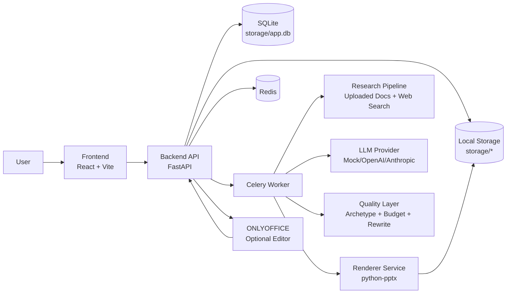
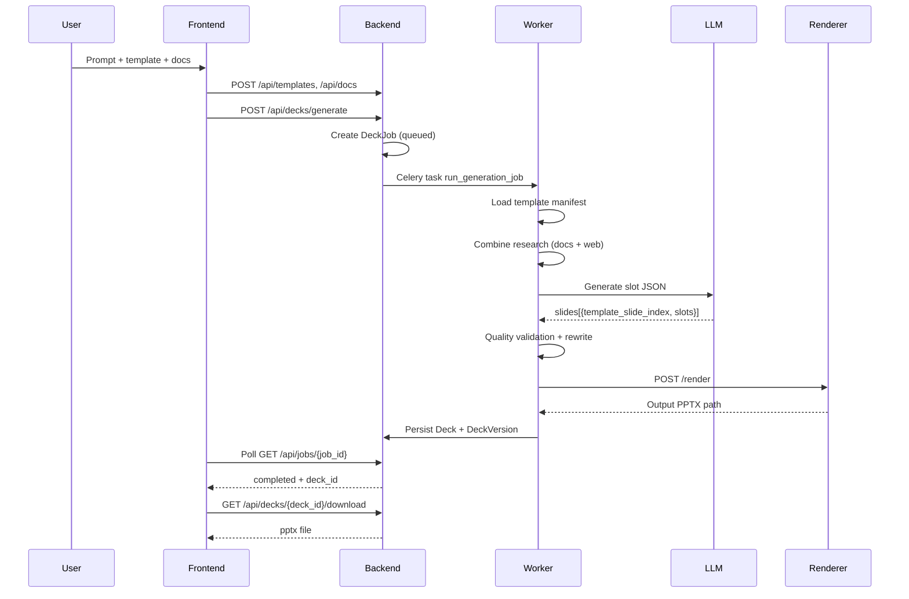
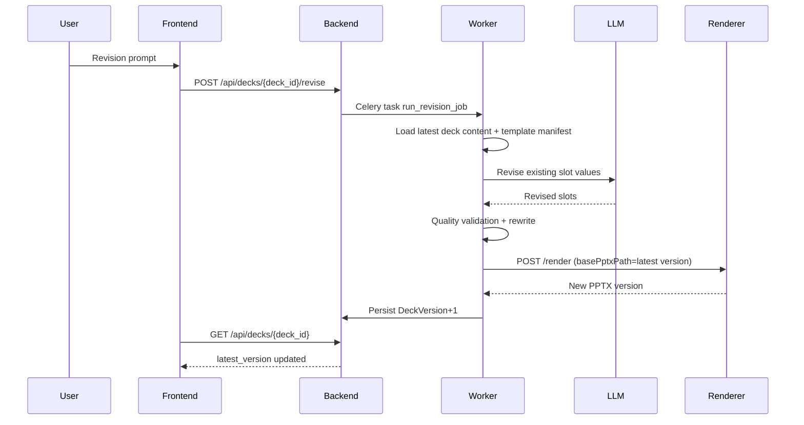

# Architecture

This document describes the runtime architecture of the PPT Ting system as of February 15, 2026.

## System Overview

The app is a template-fidelity PowerPoint generation agent:
- Internal teams upload literal `.pptx` templates.
- Backend extracts editable slots from tokens/placeholders.
- LLM generates slot values only.
- Quality layer enforces formatting and constraints.
- Renderer mutates the original template to keep design fidelity.

## Component Diagram

## Generation Sequence

## Revision Sequence

## Data Model (Backend)

- `Template`: uploaded template metadata + manifest path
- `DocumentAsset`: uploaded source docs + extracted text path
- `Deck`: logical deck record (points to template + latest version)
- `DeckVersion`: immutable generated/revised snapshot of deck output
- `DeckJob`: async generation/revision job status

## Template Fidelity Strategy

1. Parse editable bindings from template:
   - `token_text` for `{{TOKEN}}` in text frames
   - `token_table` for `{{TOKEN}}` in table cells
   - `shape_text` for auto-bound placeholders
2. Keep original template `.pptx` as rendering baseline.
3. Replace only bound slot values.
4. Prune unselected template slides.

This ensures shape coordinates, color styles, theme, charts, and non-bound objects remain unchanged.

## Quality Layer

The quality layer runs before render and performs deterministic normalization:
- Slot type classification (`TITLE`, `BODY`, `BULLET`, `CITATION`, etc)
- Slide archetype guidance (`agenda`, `timeline`, `kpi`, etc)
- Slot character budget enforcement
- Missing slot fallback values
- Bullet formatting normalization
- Citation prefix normalization (`Source:`)

## Storage Layout

- `storage/templates/` uploaded template binaries
- `storage/uploads/` uploaded docs
- `storage/manifests/` template manifests + content manifests
- `storage/citations/` citation manifests
- `storage/outputs/` generated pptx outputs
- `storage/app.db` sqlite database

## Deployment Notes

Current deployment model is single-node local Docker Compose.
For production, split storage and DB from local disk and use managed services.
