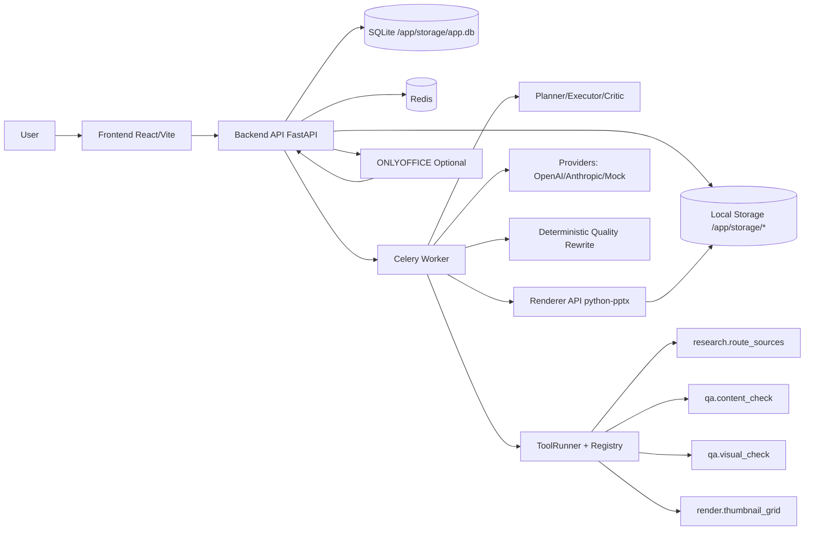
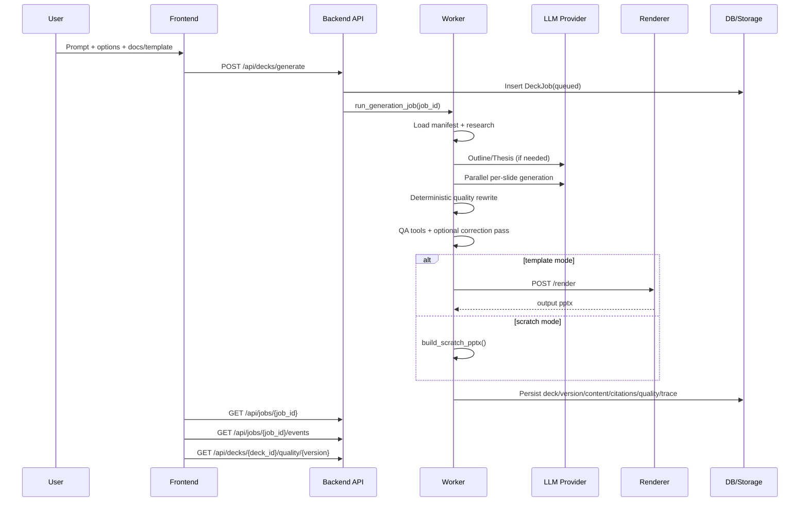
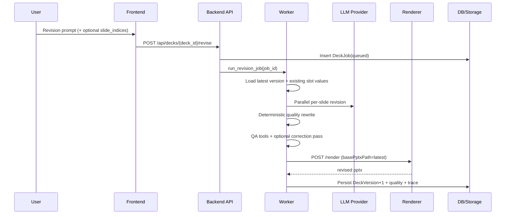

# Architecture

Status date: February 15, 2026

This document reflects the current runtime architecture in code (backend, worker, renderer, frontend).

## System Overview

PPT Ting is an async, template-fidelity PPTX generation system with bounded agent controls.

Core behavior:
- Users upload templates and reference documents.
- Generation/revision runs as Celery jobs.
- LLMs generate slot content, not layout geometry.
- Renderer applies slot content while preserving template structure/formatting.
- Agent-mode jobs run toolized research routing and QA checks, with bounded correction passes.

Two creation modes:
- `template`: mutate a real uploaded template.
- `scratch`: compose a new deck with themed layouts/components in backend.

## Runtime Components

## Generation Architecture

Entry point:
- `POST /api/decks/generate`

Request controls:
- `agent_mode`: `off | bounded`
- `quality_profile`: `fast | balanced | high_fidelity`
- `max_correction_passes`: client override, server-bounded

High-level flow in `app.tasks.run_generation_job`:
1. Load/generate template manifest.
2. Gather research:
   - uploaded docs (local extracted text)
   - Exa web research (`EXA_API_KEY` configured)
3. Resolve outline:
   - use provided outline or call provider outline generation
4. Resolve deck thesis:
   - outline thesis or provider thesis generation
5. Select slides and build generation manifest.
6. Parallel per-slide generation (`ThreadPoolExecutor`):
   - slide-level research routing (tool-backed)
   - provider call per slide
7. Deterministic quality rewrite:
   - slot defaults, budgets, bullet/citation normalization, keyword checks
8. Agent-mode QA:
   - `qa.content_check`
   - `qa.visual_check` (except `fast` profile)
9. Bounded correction loop:
   - if critical issues, regenerate targeted slides only
   - rerun quality + QA tools
10. Render output:
   - `template` mode -> renderer service
   - `scratch` mode -> backend scratch builder
11. Persist artifacts:
   - `Deck`, `DeckVersion`
   - content/citations manifests
   - `QualityReport`
   - trace rows (`JobEvent`, `ToolRun`)

## Revision Architecture

Entry point:
- `POST /api/decks/{deck_id}/revise`

Current behavior:
1. Load latest deck version and template manifest.
2. Load existing slide slot payload:
   - from saved content manifest, or
   - extracted live from PPTX bindings if missing.
3. Apply optional `slide_indices` scope.
4. Run parallel per-slide revision (same routing/tooling pattern as generation).
5. Deterministic quality rewrite.
6. Agent-mode QA + optional bounded correction loop.
7. Render new deck version.
8. Persist new `DeckVersion`, `QualityReport`, and job/tool traces.

## Sequence Diagrams

### Generation

### Revision

## Data Model (Current)

Core tables:
- `templates`
- `document_assets`
- `decks`
- `deck_versions`
- `deck_jobs`
- `deck_outlines`

New observability/quality tables:
- `job_events`
  - stage/event timeline per job
- `tool_runs`
  - tool invocation audit (status, duration, hashes, artifacts, error)
- `quality_reports`
  - per deck/version QA summary + score + issues + correction passes

## API Surface (Current)

Core:
- `POST /api/templates`
- `GET /api/templates`
- `DELETE /api/templates/{template_id}`
- `POST /api/templates/cleanup`
- `POST /api/docs`
- `GET /api/docs`
- `POST /api/decks/generate`
- `POST /api/decks/{deck_id}/revise`
- `GET /api/jobs/{job_id}`
- `GET /api/decks`
- `GET /api/decks/{deck_id}`
- `GET /api/decks/{deck_id}/download`

Outline:
- `POST /api/decks/outline`
- `GET /api/decks/outline/{job_id}`

Agent observability:
- `GET /api/jobs/{job_id}/events`
- `GET /api/decks/{deck_id}/quality/{version}`

Other:
- `POST /api/search`
- `POST /api/editor/session`
- `POST /api/editor/callback`

## Tooling Layer (Current)

Implemented toolized operations:
- `research.route_sources`
- `qa.content_check`
- `qa.visual_check`
- `render.thumbnail_grid`

Execution model:
- all tool calls go through `ToolRunner`
- schema validation + standardized `ToolResult`
- audit persisted to `tool_runs`

## Prompt and Skill Context

Prompt system includes:
- slide-level archetype guidance and examples
- slot context (shape size, existing text, font hints)
- deck thesis propagation
- richer research excerpts/snippets

PPTX skill content is loaded into prompt context from:
- configured skill root (`PPTX_SKILL_ROOT`) or bundled fallback docs.

Note:
- skill guidance is currently used as prompt/runtime context.
- full OOXML script toolchain execution is not yet wired as first-class runtime tools.

## Scratch Rendering Strategy

Scratch mode uses backend composition with theme-aware styling:
- themes: `default`, `dark`, `corporate`
- archetype-aware layout selection
- content-density layout adjustments
- visual treatment (backgrounds, accent strip, card fills, typography)

Goal:
- avoid plain white text-only outputs in scratch decks.

## Logging and Traceability

Current logging includes:
- phase/state transitions
- per-slide generation/revision start and done
- research routing decisions
- provider request timing + payload previews
- QA and correction-pass events

User-visible trace:
- frontend polls `/api/jobs/{job_id}/events` and displays recent events.

## Storage Layout

- `storage/templates/`
- `storage/uploads/`
- `storage/manifests/`
- `storage/citations/`
- `storage/outputs/`
- `storage/app.db`

## Current Limitations

- Agent loop is bounded and deterministic, not open-ended autonomy.
- QA visual check is heuristic (content/fit risk), not image-diff vision analysis.
- Runtime toolset does not yet include full OOXML unpack/patch/validate/pack pipeline.
- SQLite/local storage remains local-dev oriented for scale and HA.
