# Architecture

Status date: February 20, 2026

This document reflects the current runtime architecture in code (backend, worker, renderer, frontend).

## System Overview

PPT Ting is an async, template-fidelity PPTX generation system with bounded agent controls.

Core behavior:
- Users upload templates and reference documents.
- Generation/revision runs as Celery jobs.
- LLMs generate slot content, not layout geometry.
- Renderer applies slot content while preserving template structure/formatting.
- Agent-mode jobs run toolized research routing and QA checks, with bounded correction passes.
- JSON-render demo queries run synchronously in backend and return dynamic chart/table specs from SQLite data.

Two creation modes:
- `template`: mutate a real uploaded template.
- `scratch`: generate themed slide payloads, then render via `scratch-renderer` (Node/PptxGenJS), with python-pptx fallback if unavailable.

## Runtime Components

```mermaid
flowchart LR
    U[User] --> F[Frontend React/Vite]
    F --> B[Backend API FastAPI]

    B --> DB[(SQLite /app/storage/app.db)]
    B --> FS[(Local Storage /app/storage/*)]
    B --> RQ[(Redis)]
    B --> W[Celery Worker]
    B --> JRA[JSON Render Agent Service]
    JRA --> DB
    JRA --> LLM2[Providers: MiniMax/OpenAI/Anthropic/Mock]
    JRA --> JT[In-process tools: symbols/prices/fundamentals/sql]

    W --> P[Planner/Executor/Critic]
    W --> TR[ToolRunner + Registry]
    TR --> T1[research.route_sources]
    TR --> T2[qa.content_check]
    TR --> T3[qa.visual_check]
    TR --> T4[render.thumbnail_grid]

    W --> LLM[Providers: MiniMax/OpenAI/Anthropic/Mock]
    W --> QL[Deterministic Quality Rewrite]
    W --> SR[Scratch Renderer API Node/PptxGenJS]
    W --> REN[Renderer API python-pptx]
    REN --> FS
    SR --> FS

    B --> OO[ONLYOFFICE Optional]
    OO --> B
```

## Generation Architecture

Entry point:
- `POST /api/decks/generate`

Request controls:
- `agent_mode`: `off | bounded`
- `quality_profile`: `fast | balanced | high_fidelity`
- `max_correction_passes`: client override, server-bounded

High-level flow in `app.tasks.run_generation_job`:
1. Load/generate template manifest.
2. Gather research:
   - uploaded docs (local extracted text)
   - Exa web research (`EXA_API_KEY` configured)
3. Resolve outline:
   - use provided outline or call provider outline generation
4. Resolve deck thesis:
   - outline thesis or provider thesis generation
5. Select slides and build generation manifest.
   - If outline returns fewer unique slides than requested, backend backfills from remaining template slides.
6. Parallel per-slide generation (`ThreadPoolExecutor`):
   - slide-level research routing (tool-backed)
   - provider call per slide
7. Deterministic quality rewrite:
   - slot defaults, budgets, bullet/citation normalization, keyword checks
8. Agent-mode QA:
   - `qa.content_check`
   - `qa.visual_check` (except `fast` profile)
9. Bounded correction loop:
   - if critical issues, regenerate targeted slides only
   - rerun quality + QA tools
10. Render output:
   - `template` mode -> renderer service (`renderer`)
   - `scratch` mode -> `scratch-renderer` service via `render_scratch_pptx()`
   - fallback: if `scratch-renderer` fails, worker falls back to python-pptx scratch builder
11. Persist artifacts:
   - `Deck`, `DeckVersion`
   - content/citations manifests
   - `QualityReport`
   - trace rows (`JobEvent`, `ToolRun`)

## Revision Architecture

Entry point:
- `POST /api/decks/{deck_id}/revise`

Current behavior:
1. Load latest deck version and template manifest.
2. Load existing slide slot payload:
   - from saved content manifest, or
   - extracted live from PPTX bindings if missing.
3. Apply optional `slide_indices` scope.
4. Run parallel per-slide revision (same routing/tooling pattern as generation).
5. Deterministic quality rewrite.
6. Agent-mode QA + optional bounded correction loop.
7. Render new deck version.
8. Persist new `DeckVersion`, `QualityReport`, and job/tool traces.

## JSON-Render Analytics Architecture

Entry point:
- `POST /api/demo/json-render/query`

Request controls:
- `agentic`: `true | false` (default `true`)
- `max_points`: bounded between `6` and `24`
- `max_steps`: optional, bounded between `1` and `3`
- `use_cache`: toggles response caching

High-level flow:
1. Ensure demo seed data exists (`demo_assets`, `demo_price_points`, `demo_fundamentals`).
2. If `agentic=false`, run deterministic query builder (`run_json_render_demo_query`).
3. If `agentic=true`, run bounded agentic flow (`run_agentic_json_render_query`):
   - response cache lookup,
   - fast-path selection when intent is confident or low-latency mode applies (`max_steps<=1`),
   - optional bounded tool loop (`list_symbols`, `get_price_history`, `get_latest_snapshot`, `get_fundamentals`, `sql_query`),
   - final payload synthesis and normalization,
   - deterministic fallback when model output is invalid.
4. Return normalized `state` + `spec` for frontend `@json-render/react` rendering.

Latency controls in settings:
- `json_render_fast_path_enabled`
- `json_render_agent_default_max_steps`
- `json_render_cache_ttl_seconds`
- `json_render_tool_cache_ttl_seconds`
- `json_render_agent_deadline_seconds`
- `json_render_llm_call_timeout_seconds`
- `json_render_agent_step_max_tokens`
- `json_render_agent_finalize_max_tokens`

## Sequence Diagrams

### Generation

### Revision

### JSON-Render Query

## Data Model (Current)

Core tables:
- `templates`
- `document_assets`
- `decks`
- `deck_versions`
- `deck_jobs`
- `deck_outlines`

New observability/quality tables:
- `job_events`
  - stage/event timeline per job
- `tool_runs`
  - tool invocation audit (status, duration, hashes, artifacts, error)
- `quality_reports`
  - per deck/version QA summary + score + issues + correction passes

JSON-render demo tables:
- `demo_assets`
- `demo_price_points`
- `demo_fundamentals`

## API Surface (Current)

Core:
- `POST /api/templates`
- `GET /api/templates`
- `DELETE /api/templates/{template_id}`
- `POST /api/templates/cleanup`
- `POST /api/docs`
- `GET /api/docs`
- `POST /api/decks/generate`
- `POST /api/decks/{deck_id}/revise`
- `GET /api/jobs/{job_id}`
- `GET /api/decks`
- `GET /api/decks/{deck_id}`
- `GET /api/decks/{deck_id}/download`
- `POST /api/demo/json-render/query`

Template deletion semantics:
- unreferenced template: hard delete row + files
- referenced template: archive (`status=archived`) to preserve deck history/revision integrity

Outline:
- `POST /api/decks/outline`
- `GET /api/decks/outline/{job_id}`

Agent observability:
- `GET /api/jobs/{job_id}/events`
- `GET /api/decks/{deck_id}/quality/{version}`

Other:
- `POST /api/search`
- `POST /api/editor/session`
- `POST /api/editor/callback`

## Tooling Layer (Current)

Implemented toolized operations:
- `research.route_sources`
- `qa.content_check`
- `qa.visual_check`
- `render.thumbnail_grid`
- `json_render.list_symbols` (in-process service tool)
- `json_render.get_price_history` (in-process service tool)
- `json_render.get_latest_snapshot` (in-process service tool)
- `json_render.get_fundamentals` (in-process service tool)
- `json_render.sql_query` (read-only guarded SQL tool)

Execution model:
- deck generation/revision tools go through `ToolRunner`
- JSON-render tools run in-process inside `json_render_agent_service`
- schema validation + normalized tool result payloads are applied in both paths
- `tool_runs` persistence currently covers `ToolRunner` path (deck jobs)

## Provider Selection and Reliability

Provider resolution:
- Runtime provider is selected by request payload `provider` or `DEFAULT_LLM_PROVIDER`.
- Factory supports `minimax`, `openai`, `anthropic`, and `mock`.
- Current frontend default is `minimax`; backend config default remains env-driven.

Reliability controls (MiniMax and Anthropic providers):
- JSON extraction tolerates fenced/noisy wrappers and repairs common malformed JSON patterns.
- Empty text outputs trigger retry.
- `stop_reason=max_tokens` triggers retry with increased token budget (bounded by configured max).

JSON-render runtime reliability:
- per-call timeout wrapper around provider text generation
- retries disabled (`retries=0`) for low-latency step/finalize calls
- hard deadline for full agent run
- fallback to deterministic data path on parse/timeout/tool failures

## Prompt and Skill Context

Prompt system includes:
- slide-level archetype guidance and examples
- slot context (shape size, existing text, font hints)
- deck thesis propagation
- richer research excerpts/snippets

PPTX skill content is loaded into prompt context from:
- configured skill root (`PPTX_SKILL_ROOT`) or bundled fallback docs.

Note:
- skill guidance is currently used as prompt/runtime context.
- full OOXML script toolchain execution is not yet wired as first-class runtime tools.

Planned integration:
- See `docs/PPTX_SKILL_INTEGRATION_BLUEPRINT.md` for phased engine integration:
  - `scratch_html` (HTML-first rendering),
  - `template_replace` (inventory/replace pipeline),
  - `template_ooxml` (unpack/edit/validate/pack pipeline).

## Scratch Rendering Strategy

Scratch mode is service-first:
- worker calls `backend/app/services/scratch_render_client.py`
- renderer endpoint: `scratch-renderer:3002/render`
- supports theme input as preset string or full 12-key theme object
- backend generates theme from natural-language prompt when explicit theme is absent

Fallback behavior:
- if scratch renderer is unavailable, worker logs warning and falls back to `build_scratch_pptx()` (python-pptx).

## Logging and Traceability

Current logging includes:
- phase/state transitions
- per-slide generation/revision start and done
- research routing decisions
- provider request timing + payload previews
- QA and correction-pass events
- JSON-render boxed trace logs with section labels (`start`, `step_begin`, `llm_*`, `tool_*`, `finalize`, `complete`)
- colorized trace output by stage/step for readability
- optional full payload dumps via `json_render_full_payload_logs=true`

User-visible trace:
- frontend polls `/api/jobs/{job_id}/events` and displays recent events.

## Storage Layout

- `storage/templates/`
- `storage/uploads/`
- `storage/manifests/`
- `storage/citations/`
- `storage/outputs/`
- `storage/app.db`

## Developer Runtime Notes

- Frontend runs Vite in Docker with polling-based watch (`CHOKIDAR_USEPOLLING=true`, Vite `server.watch.usePolling=true`) to ensure HMR works on Windows bind mounts.
- When changing watcher-related frontend env/config, recreate frontend container (`docker compose up -d --force-recreate frontend`).

## Current Limitations

- Agent loop is bounded and deterministic, not open-ended autonomy.
- QA visual check is heuristic (content/fit risk), not image-diff vision analysis.
- Runtime toolset does not yet include full OOXML unpack/patch/validate/pack pipeline.
- SQLite/local storage remains local-dev oriented for scale and HA.
- Template deletion is conservative: templates referenced by existing decks are archived (hidden from default list) rather than physically deleted.
- JSON-render demo uses synthetic SQLite data and does not yet connect to external market data providers.
